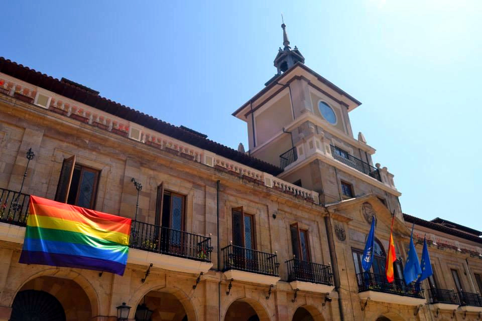

En el acto institucional de este año se hará un repaso de lo ocurrido en los últimos doce meses y se expondrán las líneas de actuación para el futuro inmediato. También se entregarán los premios _**«Ladrillo Rosa»**_, que denuncia actitudes homófobas y discriminatorias, y _**«Triángulo Rosa»**_, que reconoce la actitud favorable hacia el colectivo LGTB+.

El acto tendrá lugar el **martes 28** de junio a las **18:00** en el **Salón de Actos del Ayuntamiento de Oviedo** (Puerta de Cimadevilla).

Programa del acto
--------------

* 18:00 - Apertura del acto y presentación de los/as miembros de la mesa
* 18:10 - Saludo de representantes de las diferentes entidades e instituciones sociales, sindicales y políticas presentes en el acto
* 18:30 - Entrega de los _Premios 28 de Junio_:
 * _Ladrillo Rosa_ (denuncia actitudes homófobas y discriminatorias hacia LGTB+)
 * _Triángulo Rosa_ (reconoce la actitud favorable hacia el colectivo LGTB+)
* 18:50 - Intervención de las diferentes Áreas y Grupos de trabajo de XEGA
* 19:20 - Clausura del acto

Acceso libre y gratuito, no se requiere invitación. Aforo limitado.

Habrá intérprete de lengua de signos. Espacio accesible, libre de barreras arquitectónicas. Si necesitas acompañamiento del voluntariado de XEGA solicítalo en el teléfono [985224029](tel:+34985224029) o envía un correo electrónico a [info@xega.org](mailto:info@xega.org) con la máxima antelación posible.

Ayuntamiento de Oviedo
------------------

<i class="fa fa-map-marker" style="color:#257eca;"></i> Plaza de la Constitución 1, Oviedo (Puerta de Cimadevilla)

<iframe width="100%" height="350" frameborder="0" scrolling="no" marginheight="0" marginwidth="0" src="//www.openstreetmap.org/export/embed.html?bbox=-5.846274197101593%2C43.35982944288724%2C-5.843082368373871%2C43.36129981308837&amp;layer=mapnik&amp;marker=43.36056463244204%2C-5.844678282737732"></iframe>

Ésta es una actividad organizada por [XEGA](https://xega.org/es/) y [XEGA XOVEN](https://xega.org/es/xega-xoven/) con la colaboración del [Ayuntamiento de Oviedo](http://www.oviedo.es/).