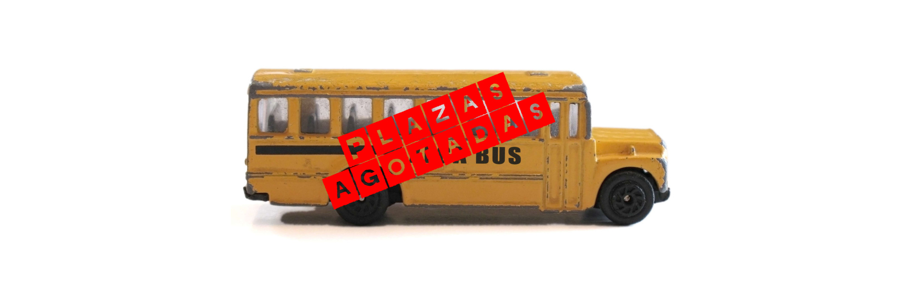

> **PLAZAS AGOTADAS**

La Manifestación estatal del Orgullo será en **Madrid** el **sábado dos de julio** de 2016 y comenzará a las **18:30** horas desde el intercambiador de Atocha hasta la Plaza Colón bajo el lema _**«Leyes por la igualdad real ¡YA! Año de la Visibilidad Bisexual en la Diversidad»**_.

La Manifestación está organizada por COGAM y FELGTB. Encontrarás [más información aquí](https://apps.xega.org/orgullo/2016/es/manifestacion-orgullo-lgtb-madrid.html).

Autobús de XEGA
------------

Como cada año, [XEGA](https://xega.org/es/) contratará un autobús para facilitar, mediante un precio asequible, la participación en la Manifestación estatal del Orgullo en Madrid no sólo a los/as miembros de la Asociación sino también a cualquier persona interesada.

Aclaramos que este autobús sólo hará la ruta Asturias-Madrid-Asturias y que no hará el recorrido de la Manifestación, es decir, **NO es una "carroza"**.

Precios
------

Todos los precios son por persona e incluyen la ida y la vuelta.

* 20,00€ - Precio general
* 10,00€ - Socias y socios de XEGA
* 10,00€ - Menores de 30 años, aun no siendo socixs de XEGA
* 5,00€ - Socias y socios de XEGA XOVEN menores de 30 años

La **compra** de billetes se puede hacer:

* En los actos públicos organizados por XEGA durante el mes ([xega.org/orgullo](https://xega.org/orgullo))
* En la sede de XEGA en Oviedo (Gascona 12, planta tercera)

También se pueden **reservar**:

* En el teléfono [985 224 029](tel:+34985224029). Si no atiende nadie, dejad mensaje en el contestador con **nombre y apellido de las personas que viajarán y un número de móvil** al que devolver la llamada de confirmación.
* En el _e-mail_ [info@xega.org](mailto:info@xega.org) indicando **nombre y apellido de las personas que viajan y un número de móvil** al que devolver la llamada de confirmación.

En caso de **reservar billete** es imprescindible que **recibáis la confirmación**, si no es que ha habido algún problema (mensaje en el contestador que no se entiende, por ejemplo).

Horarios
-------

### Sábado dos de julio de 2016

* 10:00 - Salida del autobús de la **Plaza San Miguel de Gijón**, delante del Banco Santander.
* 10:20 - El autobús pasa por la **Calle Gascona 12 de Oviedo**, sede de XEGA, para recoger materiales.
* 10:30 - El autobús pasa por la **Plaza América de Oviedo**, delante de La Caixa.
* 12:00 - **Parada en Palazuelo para comer**. Recordamos que los precios del área de servicio de Palazuelo pueden ser excesivos, recomendamos llevar bocadillo de casa a quienes lo consideren oportuno.
* 17:30 - **Llegada a Madrid**. En este momento ya habrá numerosas calles cortadas al tráfico por lo que el/la chófer(esa) intentará dejarnos lo más cerca posible de la **glorieta de Atocha** (delante del 100 Montaditos), pero dependerá del tráfico y de las indicaciones de la Policía.
* 18:30 - **Comienza la Manifestación**. Saldremos de la **glorieta de Atocha**, para recorrer el Paseo del Prado y Recoletos, finalizando en la **Plaza Colón**.
* 21:00 - Cuando lleguemos al final del recorrido de la Manifestación, al lado del escenario de la Plaza Colón, se marcará la **zona con banderas de Asturias como referencia**. En este punto se irá recogiendo todo el material de XEGA (banderas, megáfonos, pancartas y estandartes), no hace falta recordar que todo aquello que "desaparezca" implicará una pérdida económica para la Asociación.
* 21:30 - Retirada al autobús. Aclaramos que **el autobús NO regresa a esta hora a Asturias**. Desde la Plaza Colón se irá (en Metro) al autobús a guardar en él todo el material de XEGA. Éste es el momento en el que, quien quiera, puede aprovechar para asearse, cambiarse de ropa, coger o dejar mochilas, etc. Otra aclaración: Si bien hace años el autobús estacionaba en la Estación del Sur (Méndez Álvaro), desde 2005 esta estación se colapsa durante el Orgullo, al igual que todas las calles del centro, por lo que **el/la chófer(esa) aparcará el autobús donde buenamente pueda** (no lo podrá mover, ya que tiene que respetar sus períodos de descanso) así que posiblemente no haya ni baños ni agua corriente.

### Domingo tres de julio de 2016

* 07:00 - **Salida del autobús de Gran Vía**, delante del edificio de Telefónica/Movistar
* 07:30 - **Parada para desayunar** en el área de servicio de Collado Villalba
* 11:00 - Parada para descansar en el área de servicio de Palazuelo
* 12:00 - Llegada del autobús a **Virgen del Camino**
* 13:30 - Llegada del autobús a **Mieres**
* 14:00 - Llegada del autobús a **Gijón**
* 14:30 - Llegada del autobús a **Oviedo (Gascona)**
* 14:45 - Llegada del autobús a **Oviedo (Plaza América)**

Consideraciones generales
--------------------

* **Meaditos/as antes de subir al autobús**. Para obtener un precio tan bajo se contrata un autobús escolar que no tiene aseo
* Cubrirse la cabeza durante la Manifestación para evitar insolaciones
* Protector solar durante la Manifestación para evitar quemaduras
* Beber agua durante la Manifestación para evitar deshidrataciones
* Calzado cómodo para la Manifestación
* Calzado no excesivamente abierto durante la noche para evitar cortes con cristales