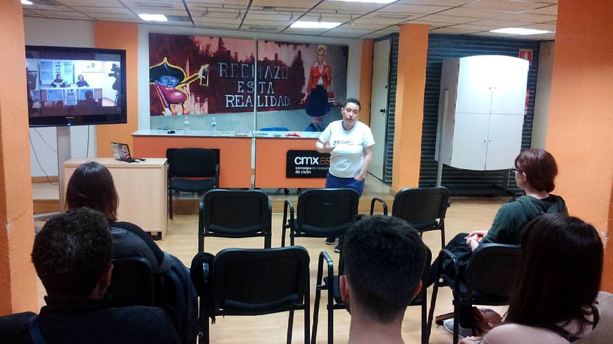
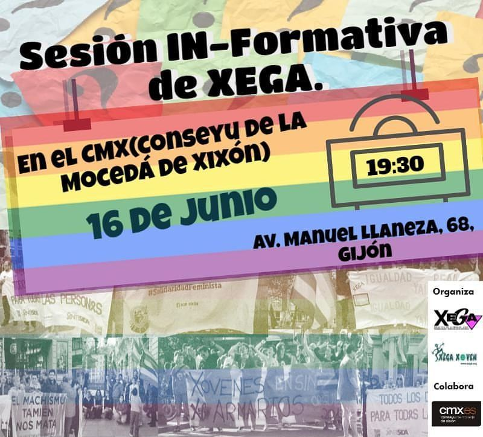

¿Quieres colaborar activamente en la defensa los derechos LGTB+? Pásate por el _**Conseyu de Mocedá de Xixón**_ el **jueves 16 de junio** a las **19:30** horas y participa en el encuentro informativo organizado por **[XEGA](//xega.org/es/)** y **[XEGA XOVEN](//xega.org/es/xega-xoven/)**.

### ¿Dónde?

El _Conseyu de Mocedá de Xixón_ está en la Avenida Manuel Llaneza 68 de Gijón.

<iframe src="//www.openstreetmap.org/export/embed.html?bbox=-5.669605135917664%2C43.53369381117313%2C-5.666413307189941%2C43.535159961117046&amp;layer=mapnik&amp;marker=43.53442689060079%2C-5.6680092215538025" marginwidth="0" marginheight="0" scrolling="no" frameborder="0" height="350" width="100%"></iframe>

Acceso libre y gratuito hasta completar aforo.

Ésta es una actividad organizada por [XEGA](//xega.org/es/) y [XEGA XOVEN](//xega.org/es/xega-xoven/) con la colaboración del _[Conseyu de Mocedá de Xixón](//www.cmx.es)_.