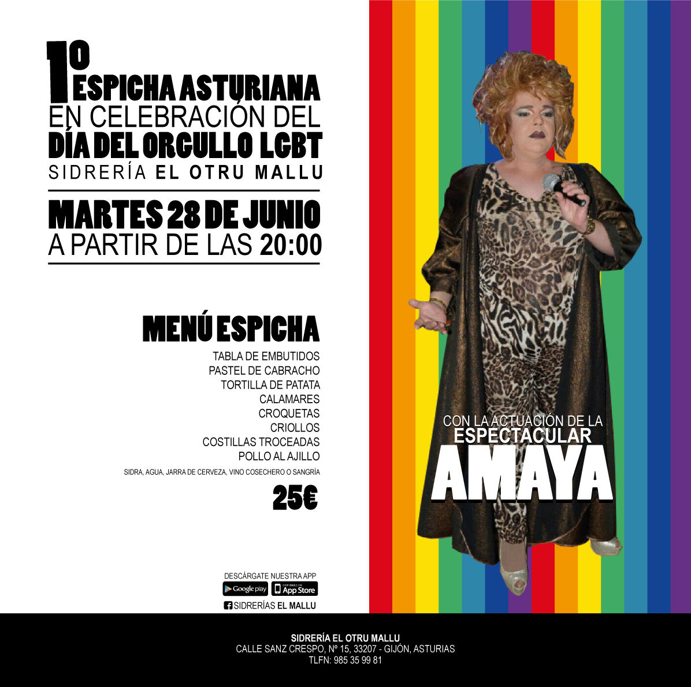

_Sidrerías «El Mallu»_ organiza el **martes 28** de junio, a partir de las **20:00** horas, en su sidrería _**«El Otru Mallu»**_ sita en la calle Sanz Crespo 15 de Gijón una espicha para celebrar el Orgullo.

El evento estará amenizado por _Amaya_. Más información en [Facebook](https://www.facebook.com/events/142442479495330/).

El Otru Mallu
----------

La sidrería _El Otru Mallu_ está en la calle Sanz Crespo 15 de Gijón.

<iframe width="100%" height="350" frameborder="0" scrolling="no" marginheight="0" marginwidth="0" src="//www.openstreetmap.org/export/embed.html?bbox=-5.671992301940918%2C43.53949014546883%2C-5.669916272163391%2C43.54032620272314&amp;layer=mapnik&amp;marker=43.53990817554515%2C-5.6709542870521545"></iframe>

Ésta es una actividad organizada por _Sidrerías El Mallu_.
