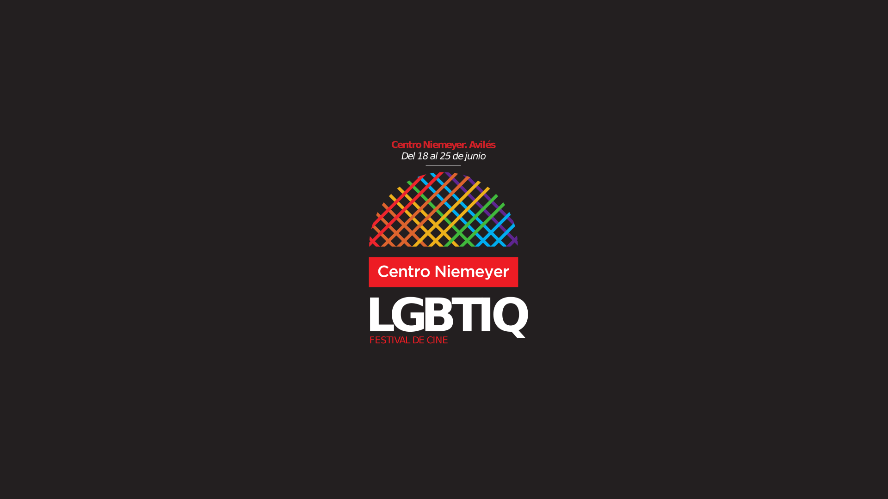

> Del sábado 18 al sábado 25 de junio de 2016 el Festival LGBTIQ explorará las temáticas lésbicas, gais, bisexuales, transexuales e intersexuales a través de doce películas.

> La programación cinematográfica se completa con un conjunto de conferencias y mesas redondas a cargo de diez instituciones y colectivos colaboradores.

El _**Festival de Cine LGBTIQ**_, organizado por el [Centro Niemeyer](http://niemeyercenter.org/), tendrá lugar entre el 18 y el 25 de junio con una programación de películas y actividades complementarias centradas en aquellos colectivos cuya sexualidad es considerada no normativa, minoritaria o que precisa de una mayor visibilidad para despertar la conciencia social.

Esta es la primera edición de un festival de cine que tiene como objetivo principal hacer visibles las inquietudes, experiencias, sentimientos y casuísticas de los diversos colectivos en los que se agrupa la ciudadanía en virtud de su identidad de género. Así, las temáticas lésbicas, gais, bisexuales, transexuales e intersexuales son el núcleo de la programación del festival. Pero también forman parte de la programación producciones audiovisuales relacionadas con la problemática de la expresión de la identidad sexual, de género y afectiva de estructuras familiares no convencionales, de jóvenes, de la tercera edad, de las personas en riesgo de exclusión (social o laboral) y de las personas con discapacidad.

Además de la programación cinematográfica, el Festival de Cine LGBTIQ se complementa con un conjunto de conferencias y mesas redonda organizadas por instituciones y asociaciones colaboradoras. De esta manera, durante la semana previa al festival, el profesorado del Programa de Doctorado y Máster de Género de la Universidad de Oviedo ofrecerá cuatro conferencias, mientras que entre el 18 y el 25 de junio tendrán lugar siete charlas de otras entidades colaboradoras.

Las diez instituciones y asociaciones colaboradoras del festival son: Universidad de Oviedo, Institutu Asturianu de la Mocedá, Conseyu de la Mocedá del Principáu d’Asturies, Centro del Profesorado y Recursos de Avilés-Occidente, XEGA, Comité Ciudadano Anti-Sida de Asturias, Asociación Asturiana para la Educación Sexual, Centro de Atención Sexual de Avilés, Carné Joven Principado de Asturias y Factoría Cultural de Avilés.

El coordinador de la programación cinematográfica del Centro Niemeyer, **Fran Gayo**, es el responsable de la selección de los doce largometrajes que componen esta primera edición.

El actual programador del Festival de Cine de Buenos Aires (BAFICI) y recientemente nombrado director del Festival de Cine Ourense matiza que el Festival de Cine LGBTIQ “no se trata tan solo de una muestra con una intención únicamente temática en torno a la cuestión de género, ya que la programación contiene propuestas formales muy personales, con planteamientos que desafían en ocasiones lo políticamente correcto y que eluden las hechuras más convencionales y los puntos de vista directamente condescendientes”.

El festival contará con dos premios que serán concedidos, respectivamente, por el público y por un jurado seleccionado por la organización. El premio del público se concederá atendiendo al número de pases y afluencia de público de cada largometraje, mientras que el premio del jurado será otorgado por mayoría simple de sus miembros.

### Programación cinematográfica

La primera edición del Festival de Cine LGBTIQ se compone de doce largometrajes de sendos países que acercarán al público películas con temáticas centradas en la sexualidad, la discapacidad, la homosexualidad, el transgénero, el SIDA o la represión por razón de orientación sexual, entre otras.

Todas las películas se proyectarán en su idioma original con subtítulos en español. Los largometrajes seleccionados para esta primera edición son los siguientes:

1. _Margarita, with a Straw_. India, 2014. Festival de Toronto: Premio NETPAC a la Mejor Película Asiática.
2. _Stories of our lives_. Kenia, Sudáfrica, 2014. Festival de Berlín 2015: Teddy Award.
3. _Barash_. Israel, 2014.
4. _E Agora? Lembra-Me_. Portugal, 2013. Festival de Locarno 2013: Premio Especial del Jurado. Festival de Valdivia 2013: Mejor Película.
5. _Te prometo anarquía_. México, Alemania, 2015. Festival de San Sebastián 2015: Mención Especial Horizontes Latinos. Festival de La Habana: Mejor Guión y Mejor Actor.
6. _Naomi Campbell_ – No es fácil convertirse en otra persona. Chile, 2014. Festival de Valdivia 2013: Mención Especial.
7. _El verano de Sangaile_. Lituania, 2015. Stockholm Film Festival 2015: Mejor Actriz. Sundance 2015: Mejor Director.
8. _Sueñan los androides_. España, 2014.
9. _Yo nena, yo princesa_ – Experiencias trans de una niña de cinco años. 2014, Argentina.
10. _Tangerine_. Estados Unidos, 2015. Independent Spirit Awards 2015: Mejor Actriz Secundaria. Premios Gotham 2015: Mejor Nuevo Actor/Actriz.
11. _The Duke of Burgundy_. Reino Unido, 2014. Premios del Cine Europeo 2015: Mejor Banda Sonora Original.
12. _Dólares de arena_. México, República Dominicana, Argentina, 2014. Festival de La Habana y Chicago Film Festival 2015: Mejor Actriz.

Nueve de estas películas entrarán en competición, quedando excluidos los largometrajes que se proyectarán en la inauguración (_Margarita, with a straw_) y en la clausura (_Dólares de arena_). Igualmente, _E Agora? Lembra-Me_ quedará fuera de competición.

### Programación complementaria

Junto con la proyección de las doce películas que componen esta primera edición del Festival de Cine LGBTIQ, un conjunto de diez conferencias y mesas redondas contribuyen a alcanzar el objetivo principal del festival, contribuir a una mayor visibilización de los colectivos no-normativos, así como a fomentar el espíritu crítico entre la ciudadanía.

Las conferencias comienzan la semana anterior al festival con el profesorado del Programa de Doctorado y Máster de Género de la Universidad de Oviedo, cuyos miembros organizarán las siguientes actividades en el Centro de Servicios Universitarios de Avilés:

1. Martes 14 de junio. _Ciudades (in)discretas_: Encuentros alternativos en el espacio urbano. A cargo de la Dra. **Isabel Carrera Suárez**.
2. Miércoles 15 de junio. _La representación de cuerpos no-normativos: fealdad, imperfección y enfermedad_. A cargo de la Dra. **Luz Mar González Arias**.
3. Jueves 16 de junio. _Quiero ser como… cuerpos modelados por el bisturí_. A cargo de la Dra. **Alejandra Moreno Álvarez**.
4. Viernes 17 de junio. _Teoría Queer, Cine Queer?_ A cargo de la Dra. **Liamar Durán Almarza**, **María Rodríguez Suárez**, **Ana-Maria Cristea**.

De forma simultánea con el desarrollo del festival tendrán lugar las siguientes mesas redondas y charlas:

1. Domingo 19 en la Sala Cine del Centro Niemeyer. _Sexualidad y discapacidad_. A cargo de **Mercedes García Ruíz** e **Ígor Nabarro**.
2. Lunes 20 de junio en el Centro de Servicios Universitarios de Avilés. _UTIGPA: Atención sanitaria a la disforia de género_. Presentación de la **UTIGPA** del Área de Salud III del Sistema de Salud del Principado de Asturias.
3. Lunes 20 de junio en la Sala Cine del Centro Niemeyer. _El transgénero visto por las familias_. Experiencias de familiares. A cargo de **Joserra Landarroitajerauregui**.
4. Lunes 20 de junio en la Sala Cine del Centro Niemeyer. _La experiencia trans desde la perspectiva juvenil_. A cargo de **XEGA XOVEN**.
5. Martes 21 de junio en la Sala Cine del Centro Niemeyer. _Sexualidades en el aula. Educando en la diversidad_. A cargo de **Ana Fernández Alonso** (jornada ofrecida por el Centro de Profesorado y Recursos de Avilés).
6. Miércoles 22 de junio en la Sala Cine del Centro Niemeyer. _VIHve y deja VIHvir_. A cargo del **Comité Ciudadano Antisida**.
7. Jueves 23 de junio en el Auditorio del Centro Niemeyer. _Diversex: Espacio de encuentro_. A cargo de **Iván Rotella**.

Las entradas para las proyecciones se pondrán a la venta el lunes 16 a las 12:00 con un precio general de 5€ y con una tarifa reducida de 3€ para miembros del Club Cultura, Carné Joven del Principado de Asturias y miembros de la comunidad universitaria de la Universidad de Oviedo. El acceso a las mesas redondas y conferencias será gratuito previa retirada de invitación en las taquillas del Centro Niemeyer y de Laboral Ciudad de la Cultura.

### Centro Niemeyer

El Centro Niemeyer se encuentra en la Avenida del Zinc de Avilés.

<iframe src="//www.openstreetmap.org/export/embed.html?bbox=-5.923433303833008%2C43.555188587615%2C-5.911438465118408%2C43.55972142020809&amp;layer=mapnik&amp;marker=43.557455046535026%2C-5.917435884475708" marginwidth="0" marginheight="0" scrolling="no" frameborder="0" height="350" width="100%"></iframe>

### Documentos relacionados

* [Programación del Festival de Cine LGBTIQ del Centro Niemeyer](20160618000000-0001a-programacion_festival_cine_lgtbtiq-niemeyer-spa.pdf)
* [Reglamento del Festival de Cine LGBTIQ del Centro Niemeyer](20160618000000-0001a-reglamento_festival_cine_lgtbtiq-niemeyer-spa.pdf)
* Lxs menores que quieran asistir a cualquiera de las actividades del festival deberán entregar en la recepción del Centro Niemeyer el documento “Autorización a menores” ([descargar aquí](20160618000000-0001a-autorizacion_menores_festival_cine_lgtbtiq-niemeyer-spa.pdf)) firmado por una madre, padre o tutor(a) legal y adjuntar una copia del DNI de la persona firmante en cumplimiento de la legislación vigente del cine y de protección al menor.

### Descuento

Muestra el siguiente vale (impreso o en pantalla del móvil) en la taquilla del Centro Niemeyer y/o de la Laboral y el personal aplicará un descuento de 2 euros en todas las entradas que solicites.

Ésta es una actividad organizada por el [Centro Niemeyer](http://niemeyercenter.org/) con la colaboración de la Universidad de Oviedo, Institutu Asturianu de la Mocedá, Conseyu de la Mocedá del Principáu d'Asturies, Centro del Profesorado y Recursos de Avilés-Occidente, XEGA, Comité Ciudadano Anti-Sida de Asturias, Asociación Asturiana para la Educación Sexual, Centro de Atención Sexual de Avilés, Carné Joven Principado de Asturias y Factoría Cultural de Avilés.