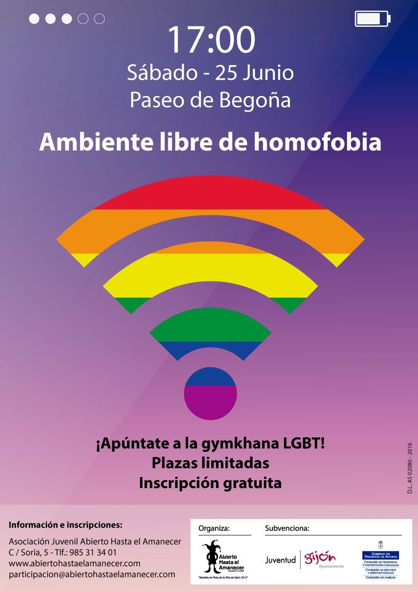

La asociación juvenil _Abierto hasta el Amanecer_ organiza una _gymkhana_ LGBT el sábado 25 de junio de 2016 a las 17:00 delante del Teatro Jovellanos, en el Paseo de Begoña de Gijón.

Se requiere inscripción previa para participar: participacion@abiertohastaelamanecer.com

Teatro Jovellanos
--------------

Paseo de Begoña, Gijón

<iframe width="100%" height="350" frameborder="0" scrolling="no" marginheight="0" marginwidth="0" src="//www.openstreetmap.org/export/embed.html?bbox=-5.663106143474579%2C43.53847325090381%2C-5.659914314746857%2C43.539939284644255&amp;layer=mapnik&amp;marker=43.539206272229784%2C-5.661510229110718"></iframe>

Ésta es una actividad organizada por [Abierto hasta el Amanecer](http://abiertohastaelamanecer.com/).