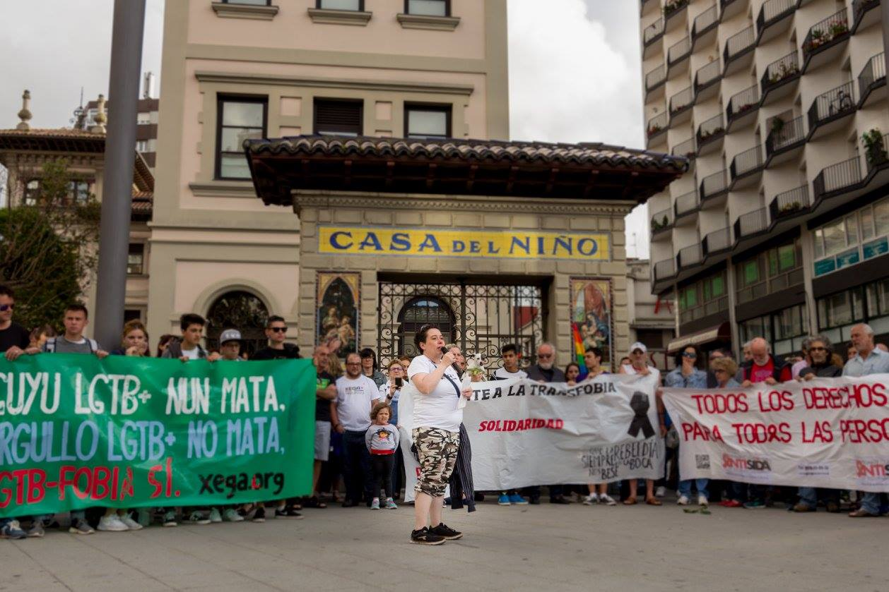

Tras el atentado sufrido en la discoteca _Pulse_ de Orlando, en el estado norteamericano de Florida, tuvieron lugar en Asturias numerosas muestras de repulsa del acto y de recuerdo y solidaridad con las 50 víctimas mortales y más de 53 heridas.

### Minuto de silencio en el Ayuntamiento de Oviedo, lunes 13 de junio de 2016

<iframe src="https://www.facebook.com/plugins/post.php?href=https%3A%2F%2Fwww.facebook.com%2Fmedia%2Fset%2F%3Fset%3Da.1127527200642952.1073741864.316442491751431%26type%3D3&width=500" width="100%" height="626" style="border:none;overflow:hidden" scrolling="no" frameborder="0" allowTransparency="true"></iframe>

### Concentración en El Humedal de Gijón, lunes 13 de junio de 2016

<iframe src="https://www.facebook.com/plugins/post.php?href=https%3A%2F%2Fwww.facebook.com%2Fmedia%2Fset%2F%3Fset%3Da.1127737353955270.1073741865.316442491751431%26type%3D3&width=500" width="100%" height="704" style="border:none;overflow:hidden" scrolling="no" frameborder="0" allowTransparency="true"></iframe>

### Minuto de silencio en el Ayuntamiento de Oviedo, martes 14 de junio de 2016

<iframe src="https://www.facebook.com/plugins/post.php?href=https%3A%2F%2Fwww.facebook.com%2Fmedia%2Fset%2F%3Fset%3Da.1128004833928522.1073741866.316442491751431%26type%3D3&width=500" width="100%" height="597" style="border:none;overflow:hidden" scrolling="no" frameborder="0" allowTransparency="true"></iframe>

En los medios
-----------

* 13/06/2016 - Europa Press - [CCOO y UGT Asturias se concentran en solidaridad con las víctimas de Orlando](http://www.europapress.es/asturias/noticia-ccoo-ugt-concentran-solidaridad-victimas-orlando-20160613134407.html)
* 13/06/2016 - Canal 10 / El Comercio - [Vídeo «Todos los derechos para todas las personas»](http://www.elcomercio.es/videos/gijon/201606/13/todos-derechos-para-todas-4939239396001-mm.html)
* 13/06/2016 - La Nueva España - [Manifestaciones en Asturias contra el ataque homófobo de Orlando](http://www.lne.es/asturias/2016/06/13/manifestaciones-ataque-homofobo-orlando/1941888.html)
* FIXME - Recopilar y concatenar piezas de TPA Noticias
* FIXME - Recopilar más fotos