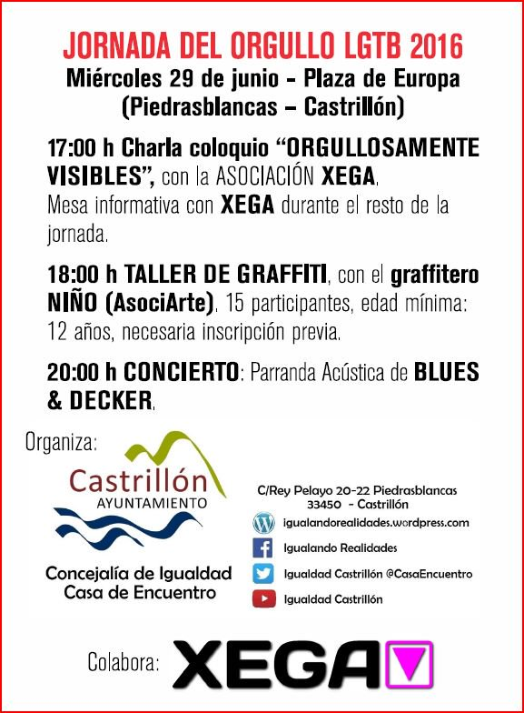

La _Concejalía de Igualdad_ de Castrillón organiza una jornada en la **Plaza Europa de Piedrasblancas** desde las **17:00** hasta las 22:00 habrá una charla coloquio conducida por [XEGA](https://xega.org/es/) y [XEGA XOVEN](https://xega.org/es/xega-xoven/), un taller de _graffiti_ y un concierto de _**Blues&Decker**_.

Programa
-------

* 17:00 Charla-coloquio _**«Orgullosamente visibles»**_ con la Asociación XEGA. Mesa informativa de XEGA durante toda la jornada.
* 18:00 Taller de graffiti con el graffitero **NIÑO** (_**AsociArte**_). 15 participantes, edad mínima: 12 años, necesaria inscripción previa.
* 20:00 - Concierto: Parranda acústica de _**Blues&Decker**_.

Plaza Europa
----------

<iframe width="100%" height="350" frameborder="0" scrolling="no" marginheight="0" marginwidth="0" src="//www.openstreetmap.org/export/embed.html?bbox=-5.980821847915649%2C43.557979857628695%2C-5.972517728805542%2C43.56132299136116&amp;layer=mapnik&amp;marker=43.559651447682235%2C-5.976669788360596"></iframe>

Ésta es una actividad organziada por la [Concejalía de Igualdad](https://igualandorealidades.wordpress.com/) del Ayuntamiento de Castrillón con la colaboración de [XEGA](https://xega.org/es/) y [XEGA XOVEN](https://xega.org/es/xega-xoven/).