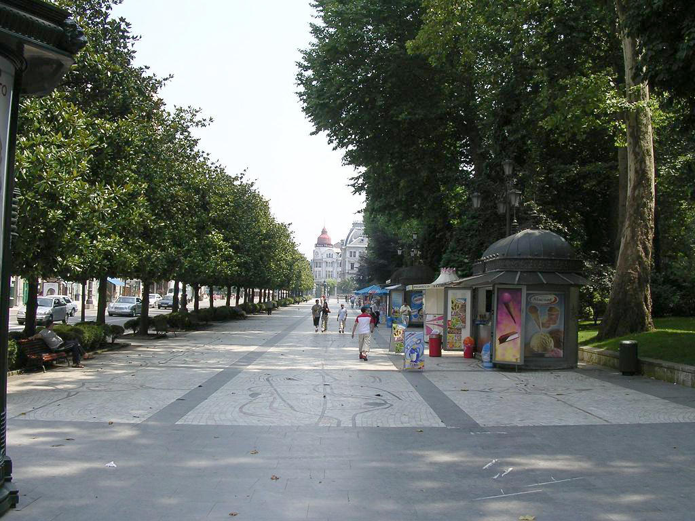

Los 28 árboles que _custodian_ el **Paseo de los Álamos** de Oviedo amanecerán el martes 28 de junio cubiertos de los colores del arcoíris para celebrar el _Día Internacional de Lesbianas, Gais, Transexuales y Bisexuales_.

A las **19:30**, una vez **[finalizado el Acto Político-institucional de XEGA _«28 de Junio»_](https://apps.xega.org/orgullo/2016/es/acto-politico-institucional-28-junio.html)**, **un pasacalles** partirá de la Plaza de La Constitución (Plaza del Ayuntamiento), recorriendo la calle Fruela hasta llegar al Paseo de los Álamos donde el artista visual y profesor **[Toño Velasco](http://www.tonovelasco.com/)** ofrecerá en directo su creación _**«Un año de besivilización»**_. Velasco ilustrará simultáneamente sobre doce lienzos, uno por cada mes del año, a parejas dándose besos, para celebrar la diversidad de las relaciones humanas.

El calendario perpetuo del Paseo también lucirá este día los colores del arcoíris.

El Paseo de los Álamos
------------------

Desde la Concejalía de Participación recuerdan que “el Paseo de Los Álamos era el lugar en el que todo el mundo se hacía visible en Oviedo. Por él paseaban todas las clases sociales, y además era un espacio especialmente adecuado para el cortejo. Por eso hemos elegido este paseo tan ovetense, que este 28 de junio será el de la Visibilidad”.

<i class="fa fa-map-marker" style="color:#0f0;" aria-hidden="true"></i> Salida: Plaza de la Constitución  
<i class="fa fa-map-marker" style="color:#f00;" aria-hidden="true"></i> Llegada: Paseo de los Álamos

<iframe width="100%" height="350" frameBorder="0" src="//umap.openstreetmap.fr/es/map/jornada-del-orgullo-lgtb-en-oviedo-2016_92136?scaleControl=false&miniMap=false&scrollWheelZoom=false&zoomControl=true&allowEdit=false&moreControl=false&datalayersControl=false&onLoadPanel=undefined&captionBar=false"></iframe>

Éstas son actividades organizadas por la [Concejalía de Participación](http://www.oviedo.es/area-de-informacion-y-participacion) del [Ayuntamiento de Oviedo](http://www.oviedo.es/).