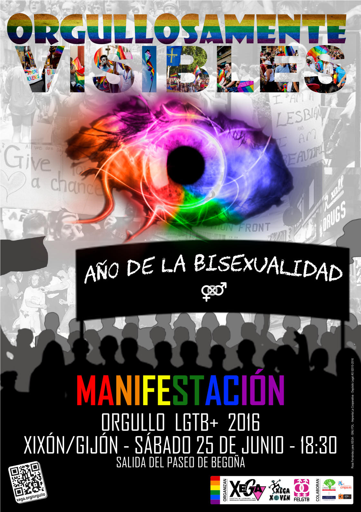

_**«Orgullosamente visibles. Año de la bisexualidad»**_ será el lema que englobe todas las reivindicaciones de la manifestación que saldrá el **sábado 25** de junio a las **18:30** horas del **Paseo de Begoña** de Gijón y recorrerá las calles Covadonga, Plazuela San Miguel, Capua y Cabrales hasta llegar a la Plaza Mayor (Plaza del Ayuntamiento) en la que se leerá el Manifiesto del Orgullo LGTB+ Asturias 2016.

Acceso libre y gratuito. Aforo ilimitado ;)

Habrá intérprete de lengua de signos durante la lectura del Manifiesto. La Manifestación se realizará íntegramente sobre la calzada, libre de barreras arquitectónicas. Si necesitas acompañamiento del voluntariado de XEGA solicítalo en el teléfono [985224029](tel:+34985224029) o envía un correo electrónico a [info@xega.org](mailto:info@xega.org) con la máxima antelación posible.

Recorrido de la manifestación
-----------------------

<i class="fa fa-map-marker" style="color:#0f0;"></i> Salida: Paseo de Begoña, Gijón  
<i class="fa fa-map-marker" style="color:#f00;"></i> Llegada: Plaza Mayor, Gijón

<iframe width="100%" height="350" frameBorder="0" src="//umap.openstreetmap.fr/es/map/itinerario-orgullo-asturias-2016_91493?scaleControl=false&miniMap=false&scrollWheelZoom=false&zoomControl=true&allowEdit=false&moreControl=true&datalayersControl=true&onLoadPanel=undefined&captionBar=false"></iframe>

El recorrido propuesto podría sufrir ligeros cambios si el _Área de Seguridad Ciudadana y Movilidad_ lo considerase necesario.

Ésta es una actividad organizada por [XEGA](https://xega.org/es/) y [XEGA XOVEN](https://xega.org/es/xega-xoven/).