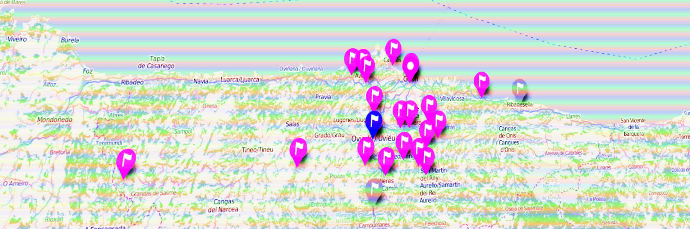

Durante los meses de junio y julio de 2016 se desarrollarán en Asturias un considerable número de actividades y 
eventos para celebrar el _Día Internacional de Lesbianas, Gais, Trans y Bisexuales_, _**Día del Orgullo**_. Los estamos recopilado en el siguiente mapa.

<iframe width="100%" height="350" frameBorder="0" src="//umap.openstreetmap.fr/es/map/mapa-orgullo-asturias-2015_91488?scaleControl=false&miniMap=false&scrollWheelZoom=false&zoomControl=true&allowEdit=false&moreControl=true&datalayersControl=true&onLoadPanel=undefined&captionBar=false"></iframe>
