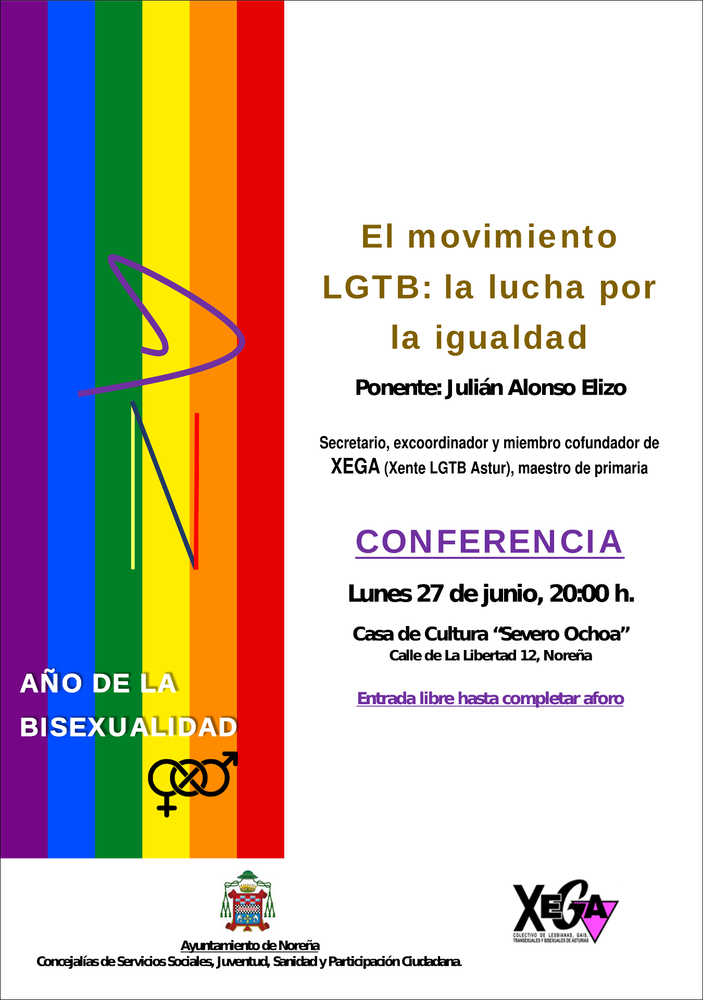

Las _Concejalías de Servicios Sociales, Juventud, Sanidad y Participación Ciudadana_ del _Ayuntamiento de Noreña_ organiza una conferencia y posterior coloquio con el título _**«El movimiento LGTB: La lucha por la igualdad»**_. Tendrá lugar en la **Casa de Cultura _Severo Ochoa_** de Noreña el **lunes 27** de junio de 2016 a las **20:00** horas.

La conferencia-coloquio será conducida por **Julián Alonso Elizo**, miembro cofundador de [XEGA](https://xega.org/es/).

Casa de Cultura _Severo Ochoa_
-----------------------

<i class="fa fa-map-marker" style="color:#00f;" aria-hidden="true"></i> Calle de La Libertad 12, Noreña

<iframe width="100%" height="350" frameborder="0" scrolling="no" marginheight="0" marginwidth="0" src="//www.openstreetmap.org/export/embed.html?bbox=-5.710334479808807%2C43.39357072585127%2C-5.707142651081085%2C43.3950402780986&amp;layer=mapnik&amp;marker=43.39430550642947%2C-5.708738565444946"></iframe>

Ésta es una actividad organizada por las _Concejalías de Servicios Sociales, Juventud, Sanidad y Participación Ciudadana_ del [Ayuntamiento de Noreña](http://www.aytonorena.es/) con la colaboración de [XEGA](https://xega.org/es/).