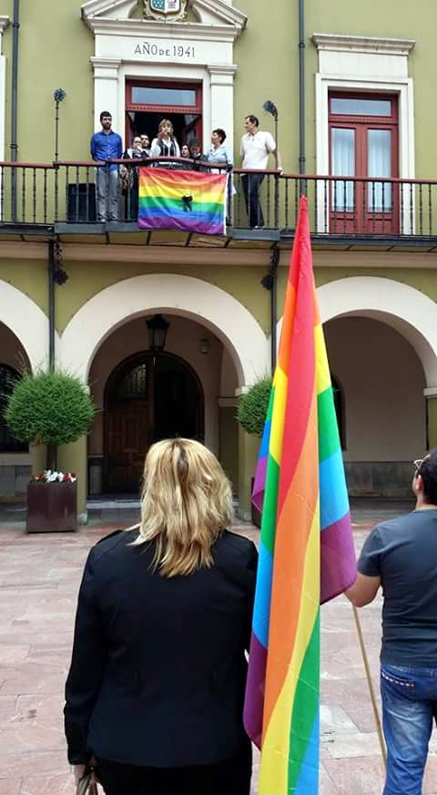

El viernes 24 de junio de 2016 se celebrará a las 12:00 en la plaza del Ayuntamiento de Langreo un acto de conmemoración del Día del Orgullo. Además de la lectura de un manifiesto, se recordará a las víctimas LGTBI.

Ésta es una actividad organizada por **Asinalgtbh Llangréu** con la colaboración del Ayuntamiento de Langreo.