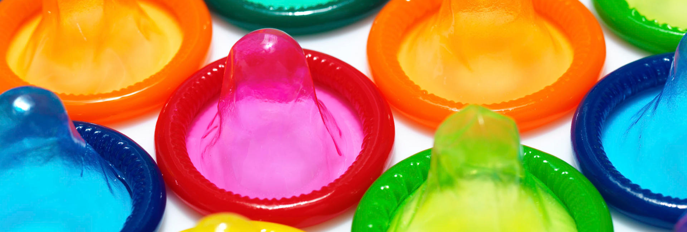

La tardes y noches del viernes 10 y sábado 11 de junio, activistas de [XEGA](https://xega.org/es/) y [XEGA XOVEN](https://xega.org/es/xega-xoven/) realizaron la distribución del cartel y la programación del Orgullo en Asturias y recursos para la prevención del VIH/sida y otras ITS.

600 carteles, 4.000 volantinas, 11.520 preservativos y 11.100 monodosis de lubricante fueron distribuidas en esta acción.

Establecimientos colaboradores en la prevención del VIH/sida y otras ITS: Boy's Sauna, Cruissing, Manboleo, Versache's, Olympo, Bear Gijón Bar, Oh La Lá!, El Camerino, Zeus, La Caleya y El Orgullín del Norte.

Las bibliotecas públicas de Asturias, casas de cultura, oficinas de información juvenil, oficinas turísticas, etc. colaboraron en la difusión.

Ésta fue una actividad organizada por [XEGA](https://xega.org/es/) y [XEGA XOVEN](https://xega.org/es/xega-xoven/), con la colaboración de la [Consejería de Sanidad de Asturias](http://www.asturias.es/).