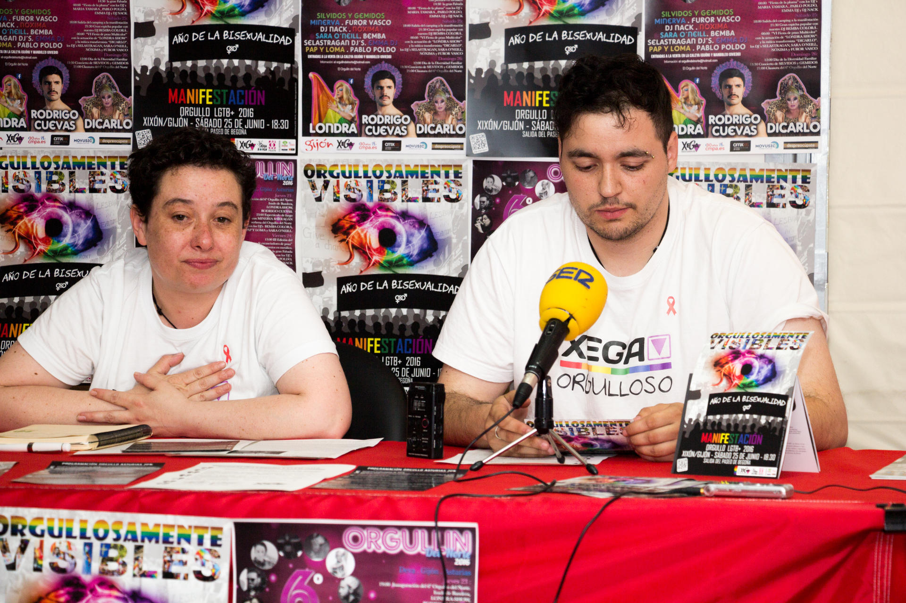

La mañana del martes 14 de junio de 2016, **Yosune Álvarez**, coordinadora de [XEGA](https://xega.org/es/), y **Christian García**, coordinador de [XEGA XOVEN](https://xega.org/es/xega-xoven/), presentaron la programación de actividades que se desarrollarán en Asturias con motivo del _Día Internacional de Lesbianas, Gais, Transexuales y Bisexuales_.

Además dieron a conocer el fallo de los Premios _Ladrillo Rosa_, que denuncia actitudes homófobas y discriminatorias hacia LGTB+ en el ámbito asturiano y _Triángulo Rosa_, que reconoce la actitud favorable hacia el colectivo LGTB+ en el ámbito asturiano.

Toda la programación de actividades con motivo del Orgullo LGTB en Asturias se encuentra actualizada en **[xega.org/orgullo](https://xega.org/orgullo/)**

Ésta fue una actividad organizada por [XEGA](//xega.org/es/) y [XEGA XOVEN](//xega.org/es/xega-xoven/).