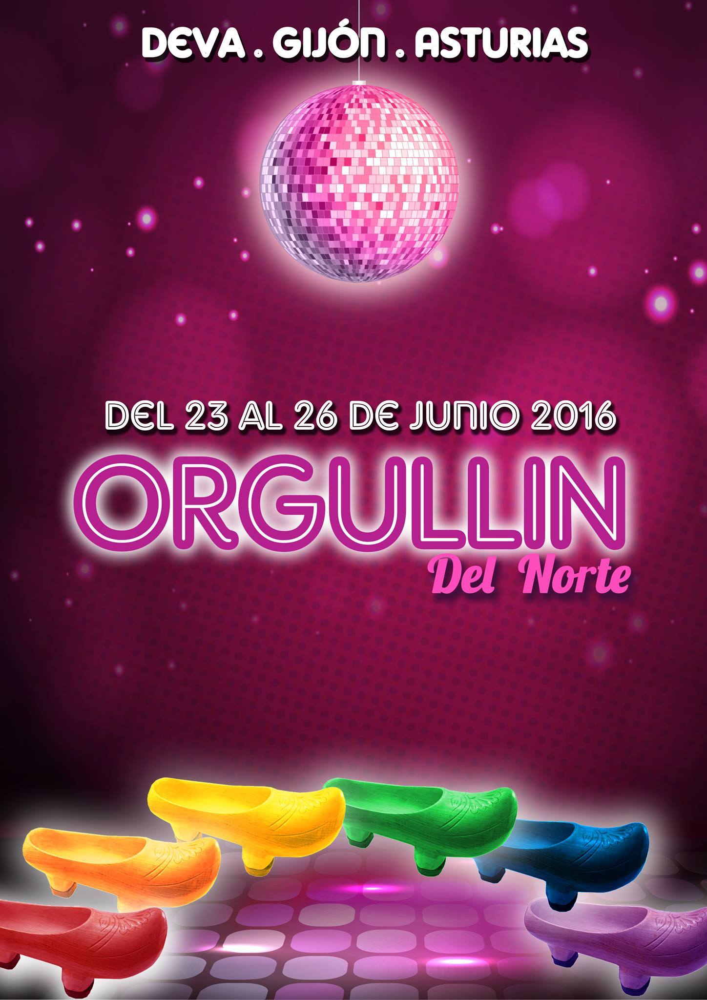

Del **jueves 23 al domingo 26** de junio en el _Camping Municipal de Deva_, en Xixón/Gijón, se celebrará la sexta edición de _**«L’Orgullín del Norte»**_. La propuesta es vivirlo como se vive todo en Asturias… En la calle… Un encuentro LGTB+ al aire libre donde no faltará la fiesta y la diversión.

Programación
----------

### Jueves 23 de junio

* 19:00 Acto de inauguración del _VI Orgullín_ e izado de bandera con **Londra Show**, Madrina del Orgullín, y **Rodrigo Cuevas**, Abanderado 2016.
* 22:00 Cena de bienvenida
* 23:00 Espectáculo de fuego a cargo de **Minerva Barragán**
* 00:00 Encendido de «La Foguera»
* 00:30 Primera fiesta con lxs DJs **Bemba Colorá**, **Pap y Loma** y **Sara O'Neill**

### Viernes 24 de junio, «Día de Asturias»

* 13:00 III Edición del «Concurso de escanciadorxs de prau»
* 14:30 La Gran Fabada
* 00:00 «Fiesta de la Pluma» con los **María Tamara**, **Pablo Poldo**, **Emma DJ** y **DJ Nack**

### Sábado 25 de junio

* 17:15 Salida del autobús del camping a la Mani
* 20:30 Regreso al camping en autobús gratuito para lxs alojadxs y, en caso de quedar plazas libres, para lxs no alojadxs
* 22:00 Gran espicha popular con **DJ Bemba Colorá**
* 00:00 «VI Fiesta de prau multicolor» con las actuaciones de **Dicarlo**, **Londra Show** y lxs DJs **Selastragan**, **Sara O'Neill**, **Moxima** y **Furor Vasko**
* 05:30 Autobús a Gijón gratuito

### Domingo 26 de junio, «Día de Las Familias»

* 12:00 Sesión vermouth con concierto de **Silvidos y Gemidos**
* 13:00 Hinchables y aminación para lxs niñxs a cargo de **Despreocúpate Eventos**
* 15:00 Gran paella para todxs
* Animación para niñxs y mayores
* 21:00 Acto de clausura del VI Orgullín del Norte

Camping Municipal de Deva
--------------------

Camín de la Pasadiella 85, Gijón

<iframe scrolling="no" marginheight="0" marginwidth="0" src="https://www.openstreetmap.org/export/embed.html?bbox=-5.6006669998168945%2C43.511362704328725%2C-5.596160888671875%2C43.51429605418322&amp;layer=mapnik&amp;marker=43.512829397078114%2C-5.598413944244385" frameborder="0" height="350" width="100%"></iframe>

Información relacionada
-------------------

* [Cartel VI Orgullín del Norte](0-cartel_orgullin_2016.jpg)
* [Programación general](cartel_orgullin_2016_programacion.jpg)
* [Programación día 1](cartel_orgullin_2016_dia_1.jpg)
* [Programación día 2](cartel_orgullin_2016_dia_2.jpg)
* [Programación día 3](cartel_orgullin_2016_dia_3.jpg)
* [Programación día 4](cartel_orgullin_2016_dia_4.jpg)
* [Precios sin alojamiento](cartel_orgullin_2016_precios_sin_alojamiento.jpg)
* [Precios con alojamiento](cartel_orgullin_2016_precios_con_alojamiento.jpg)

Ésta es una actividad organizada por _L’Orgullín del Norte_. Más información en [Facebook](https://www.facebook.com/elorgullin.delnorte), en el _e-mail_ [elorgullindelnorte@hotmail.com](mailto:elorgullindelnorte@hotmail.com) y en el [661549147](tel:+34661549147) (WhatsApp).